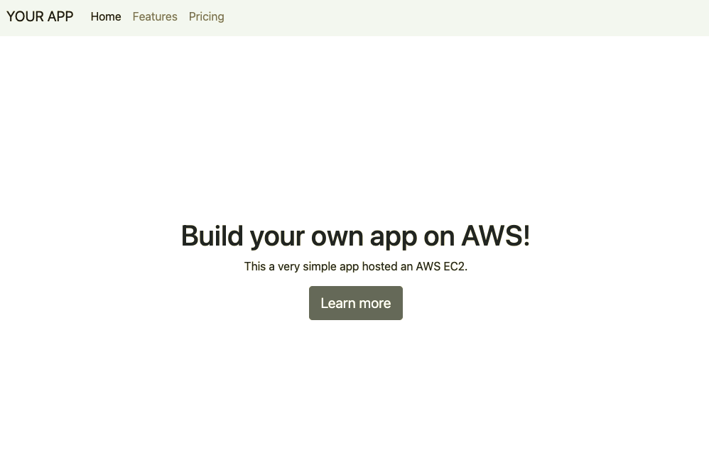

# TERRAFORM SIMPLE NODE APP ON AWS

## Introduction

This repo demonstrates how to deploy a node app on AWS EC2 leveraging IaC.



## Features

- [x] Fully automated deployment via terraform
- [x] implemented waiter for ec2 user data (cloud init) to be finished

## Prerequisites

- [x] AWS Account with user/role credentials having necessary IAM permissions
- [x] terraform binary installed

## Getting started

Set your aws credentials e.g.

```bash
# For user
$ export AWS_ACCESS_KEY_ID = <myAccessKeyID>
$ export AWS_SECRET_ACCESS_KEY = <mySecretAccessKey>
# For role
$ export AWS_ACCESS_KEY_ID = <myAccessKeyID>
$ export AWS_SECRET_ACCESS_KEY = <mySecretAccessKey>
$ export AWS_SESSION_TOKEN = <mySessionToken>
```

Execute the standard terraform flow like this:

```bash
# Init, plan and apply
$ terraform init
$ terraform plan -out myplan
$ terraform apply myplan
```

## Terraform
<!-- BEGINNING OF PRE-COMMIT-TERRAFORM DOCS HOOK -->
## Requirements

| Name | Version |
|------|---------|
| <a name="requirement_terraform"></a> [terraform](#requirement\_terraform) | >= 1.0.0 |
| <a name="requirement_aws"></a> [aws](#requirement\_aws) | >= 4.0.0 |

## Providers

| Name | Version |
|------|---------|
| <a name="provider_aws"></a> [aws](#provider\_aws) | 4.22.0 |
| <a name="provider_null"></a> [null](#provider\_null) | 3.1.1 |
| <a name="provider_random"></a> [random](#provider\_random) | 3.3.2 |
| <a name="provider_tls"></a> [tls](#provider\_tls) | 3.4.0 |

## Modules

| Name | Source | Version |
|------|--------|---------|
| <a name="module_vpc"></a> [vpc](#module\_vpc) | terraform-aws-modules/vpc/aws | 3.14.2 |

## Resources

| Name | Type |
|------|------|
| [aws_iam_instance_profile.node](https://registry.terraform.io/providers/hashicorp/aws/latest/docs/resources/iam_instance_profile) | resource |
| [aws_iam_role.node](https://registry.terraform.io/providers/hashicorp/aws/latest/docs/resources/iam_role) | resource |
| [aws_iam_role_policy.node](https://registry.terraform.io/providers/hashicorp/aws/latest/docs/resources/iam_role_policy) | resource |
| [aws_instance.node](https://registry.terraform.io/providers/hashicorp/aws/latest/docs/resources/instance) | resource |
| [aws_key_pair.ec2](https://registry.terraform.io/providers/hashicorp/aws/latest/docs/resources/key_pair) | resource |
| [aws_security_group.ec2](https://registry.terraform.io/providers/hashicorp/aws/latest/docs/resources/security_group) | resource |
| [null_resource.wait_for_cloudinit](https://registry.terraform.io/providers/hashicorp/null/latest/docs/resources/resource) | resource |
| [random_id.this](https://registry.terraform.io/providers/hashicorp/random/latest/docs/resources/id) | resource |
| [tls_private_key.ec2](https://registry.terraform.io/providers/hashicorp/tls/latest/docs/resources/private_key) | resource |
| [aws_ami.ubuntu](https://registry.terraform.io/providers/hashicorp/aws/latest/docs/data-sources/ami) | data source |
| [aws_caller_identity.this](https://registry.terraform.io/providers/hashicorp/aws/latest/docs/data-sources/caller_identity) | data source |
| [aws_iam_policy_document.node](https://registry.terraform.io/providers/hashicorp/aws/latest/docs/data-sources/iam_policy_document) | data source |
| [aws_region.this](https://registry.terraform.io/providers/hashicorp/aws/latest/docs/data-sources/region) | data source |

## Inputs

| Name | Description | Type | Default | Required |
|------|-------------|------|---------|:--------:|
| <a name="input_default_tags"></a> [default\_tags](#input\_default\_tags) | Default tags to apply to all taggable resources | `map(any)` | `{}` | no |
| <a name="input_region"></a> [region](#input\_region) | Region to be used | `string` | `"eu-central-1"` | no |

## Outputs

| Name | Description |
|------|-------------|
| <a name="output_caller_identity"></a> [caller\_identity](#output\_caller\_identity) | Caller identiy |
| <a name="output_ec2_id"></a> [ec2\_id](#output\_ec2\_id) | ID of the ec2 instance |
| <a name="output_ec2_name"></a> [ec2\_name](#output\_ec2\_name) | Name of the ec2 instance |
| <a name="output_ec2_private_key_pem"></a> [ec2\_private\_key\_pem](#output\_ec2\_private\_key\_pem) | Private key in pem format for accessing ec2 instance |
| <a name="output_ec2_public_dns"></a> [ec2\_public\_dns](#output\_ec2\_public\_dns) | Public DNS for the instance |
| <a name="output_ec2_public_ip"></a> [ec2\_public\_ip](#output\_ec2\_public\_ip) | Public IP for the instance |
<!-- END OF PRE-COMMIT-TERRAFORM DOCS HOOK -->
